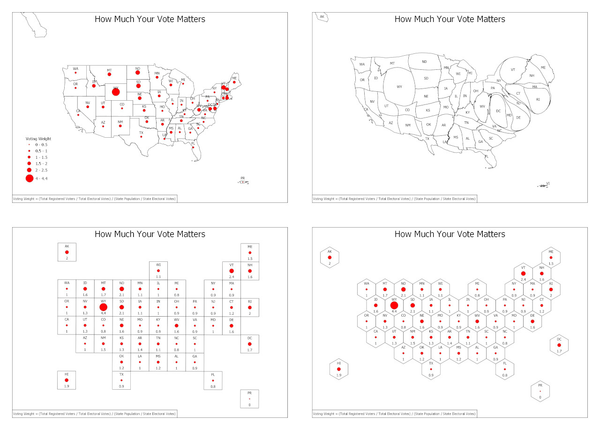

# cartograms
This repository provides some sample data for generating cartograms of the United States

Sample Data Layers:

- ElectoralWeightsTable
- USA_Continuous_Cartogram
- USA_Grid_Cartogram
- USA_Grid_Cartogram_Centroid
- USA_Grid_Cartogram_Centroid_Electoral_Joined
- USA_Hex_Cartogram
- USA_Hex_Cartogram_Centroid
- USA_Hex_Cartogram_Centroid_Electoral_Joined
- USA_Original
- USA_Original_Centroid
- USA_Original_Centroid_Electoral_Joined 